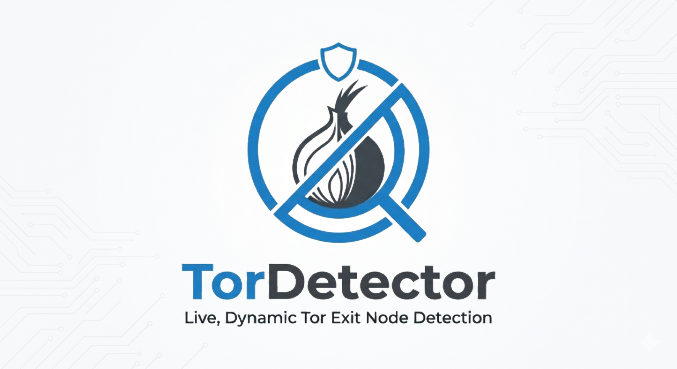

# @torshield/express

<p align="center">
  
</p>

<p align="center">
  Express middleware adapter for blocking Tor exit-node traffic.
</p>

<p align="center">
  
  
  
</p>

## Install

```bash
pnpm add @torshield/express express
```

## Quick Start

Initialize detector once during app bootstrap, then register the middleware.

```ts
import express from 'express'
import {initializeDetector, blockTorExitNodesMiddleware} from '@torshield/express'

const app = express()

initializeDetector({
	statusCode: 403,
	message: 'Access denied: Tor exit node traffic is not allowed.',
})

app.set('trust proxy', true)
app.use(blockTorExitNodesMiddleware())

app.get('/health', (_req, res) => {
	res.json({ok: true})
})
```

## API

### `initializeDetector(options?)`

Creates (once) and starts the singleton detector used by this package.  
Call this before `blockTorExitNodesMiddleware()`.

### `blockTorExitNodesMiddleware()`

Returns Express middleware that:

- extracts the client IP from `x-forwarded-for` (left-most value) or socket address
- checks Tor membership via `@torshield/core`
- calls `next()` for allowed traffic
- responds with `statusCode` and `{error: message}` for blocked traffic

Detector options type:

<!-- docs-sync:express-options:start -->

```ts
type TorExitNodeMiddlewareOptions = {
	statusCode?: number
	message?: string
	onRefresh?: (count: number) => void
	onError?: (error: unknown) => void
	verbose?: boolean
}
```

<!-- docs-sync:express-options:end -->

Default values:

<!-- docs-sync:express-defaults:start -->

- `statusCode`: `403`
- `message`: `Access denied: Tor exit node traffic is not allowed.`
<!-- docs-sync:express-defaults:end -->

## Behavior Notes

- Singleton detector instance is reused across middleware registrations.
- Middleware requires prior initialization (`initializeDetector(...)`).
- Refresh loop runs in background every 24 hours.
- Startup/refresh failures are fail-open (no hard crash).

## Reverse Proxy Setup

When running behind Nginx, Cloudflare, ingress, or ALB, enable trust proxy:

```ts
app.set('trust proxy', true)
```

Without this, the adapter may receive proxy IPs instead of real client IPs.
